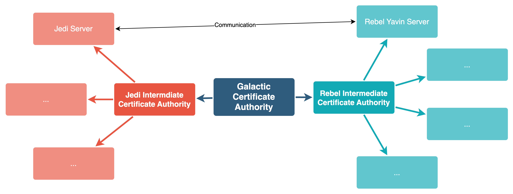

### Solution
There is always a neutral party which generates certificates for all which is the root CA. Let's generate that first. We will use eliptic curve as algorithm to generate private keys for all entities.

### Entities


### Generating parameter file for private key generation
```bash
openssl genpkey -genparam -algorithm ec -pkeyopt ec_paramgen_curve:secp521r1 -out ec_param.pem
```

### Creating files and directories which will be used to stored signed certificates by GCA and other intermediate CAs
```bash
mkdir gca_issued jedi_ca_issued rebel_ca_issued
echo -n > root_index.txt
echo -n > jedi_index.txt
echo -n > rebel_index.txt
```

### Galactic Certificate Authority
```bash
openssl genpkey -paramfile ec_param.pem -out gca_pkey.pem
openssl req -config openssl.cnf -section root_req -new -key gca_pkey.pem -out gca_csr.pem
openssl ca -config openssl.cnf -selfsign -section root_ca -in gca_csr.pem -out gca_cert.pem
```

### Jedi Certificate Authroity
```bash
openssl genpkey -paramfile ec_param.pem -out jedi_ca_pkey.pem
openssl req -config openssl.cnf -section jedi_ca_req -new -key jedi_ca_pkey.pem -out jedi_ca_csr.pem
openssl ca -config openssl.cnf -section root_ca -in jedi_ca_csr.pem -out jedi_ca_cert.pem
```

### Rebel Certificate Authroity
```bash
openssl genpkey -paramfile ec_param.pem -out rebel_ca_pkey.pem
openssl req -config openssl.cnf -section rebel_ca_req -new -key rebel_ca_pkey.pem -out rebel_ca_csr.pem
openssl ca -config openssl.cnf -section root_ca -in rebel_ca_csr.pem -out rebel_ca_cert.pem
```

### Rebel Server 1
```bash
openssl genpkey -paramfile ec_param.pem -out yavin_pkey.pem
CN="yavin.local" openssl req -config openssl.cnf -section leaf_req -new -key yavin_pkey.pem -out yavin_csr.pem
openssl ca -config openssl.cnf -section rebel_ca -in yavin_csr.pem -out yavin_cert.pem
```

### Jedi Client 1
```bash
openssl genpkey -paramfile ec_param.pem -out jedi_server_pkey.pem
CN="jedi_server.local" openssl req -config openssl.cnf -section leaf_req -new -key jedi_server_pkey.pem -out jedi_server_csr.pem
openssl ca -config openssl.cnf -section jedi_server_ca -in jedi_server_csr.pem -out jedi_server_cert.pem
```

### Rebel OCSP Responder
```bash
openssl genpkey -paramfile ec_param.pem -out rebel_ocsp.pem
openssl req -config openssl.cnf -section rebel_ocsp_req -new -key rebel_ocsp.pem -out rebel_ocsp_csr.pem
openssl ca -config openssl.cnf -section rebel_ca -in rebel_ocsp_csr.pem -out rebel_ocsp_cert.pem
```

### Running OCSP Server
```bash
openssl ocsp -port 8888 -index ./rebel_index.txt -CA rebel_ca_cert.pem -rkey rebel_ocsp.pem -rsigner rebel_ocsp_csr.pem 
```

### Running OCSP Client to verify
```bash
openssl ocsp -issuer rebel_ca_cert.pem  -cert yavin_cert.pem -url http://ocsp.local:8888 -resp_text
```